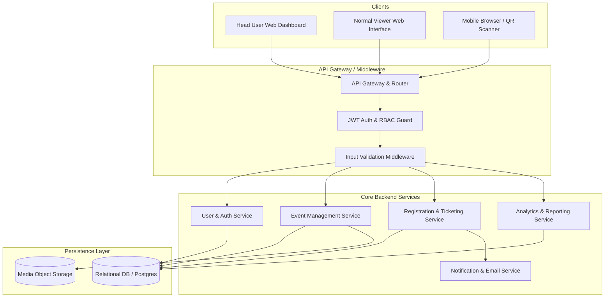
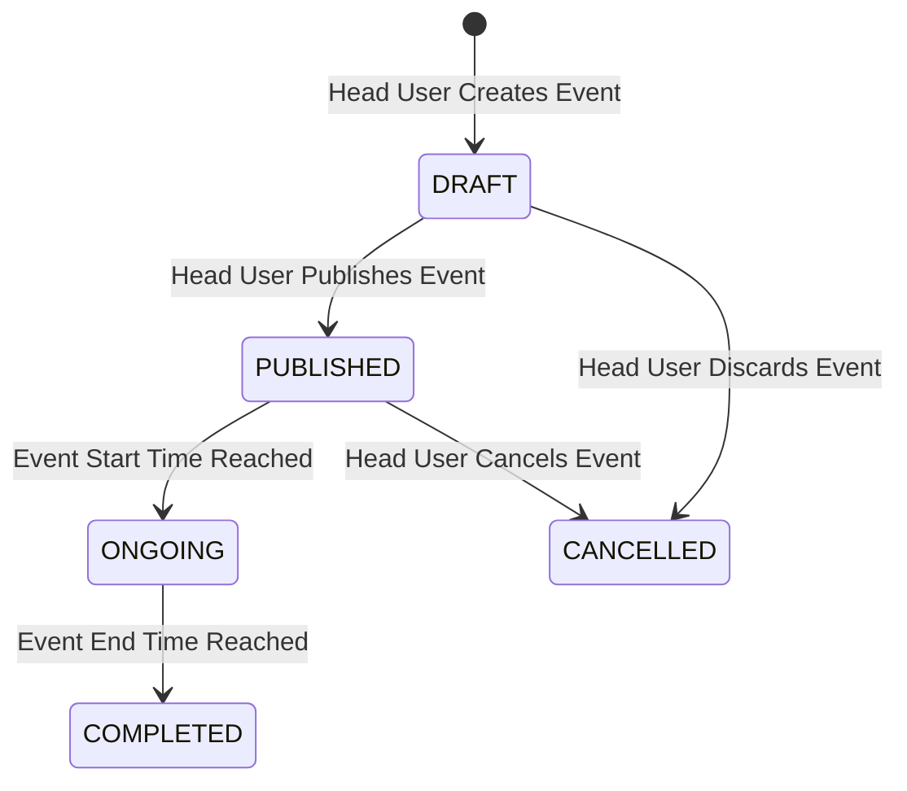
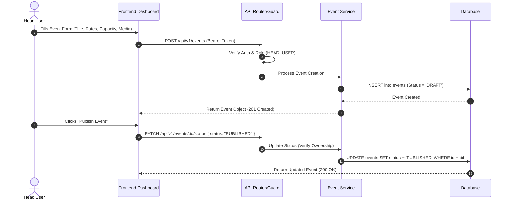
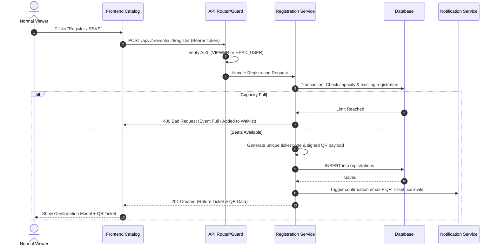
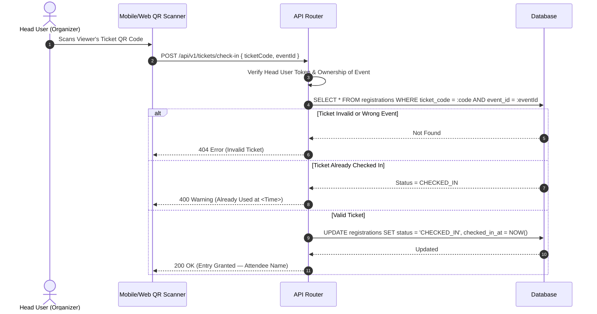

# 🏗️ Event Management System (EMS) — Technical Architecture & System Design

## 1. System Overview & Architecture Paradigm

The **Event Management System (EMS)** follows a decoupled **Client-Server Architecture** operating over HTTP RESTful APIs (or GraphQL) with Role-Based Access Control (RBAC). 

The platform separates responsibilities into distinct layers:
* **Presentation Layer (Frontend UI):** Dynamic web client serving both **Head Users** (Organizers/Admins) and **Normal Viewers** (Attendees/Participants).
* **API Gateway & Routing Layer:** Handles authentication verification, rate limiting, request validation, and RBAC authorization.
* **Business Logic Layer (Services):** Core domain services handling event lifecycle management, registration logic, ticket/QR generation, and analytics aggregation.
* **Data Layer (Database & Storage):** Relational database (PostgreSQL/SQLite) for structured entity persistence, alongside object storage for event media assets.

---

## 2. High-Level Architecture Diagram



---

## 3. Subsystem Breakdown

### 3.1. Authentication & RBAC Subsystem
* **JWT Token Claims:** Embeds `userId`, `email`, and `role` (`HEAD_USER` vs. `VIEWER`).
* **Route Guards:**
  * `Public`: Accessible without credentials (event browsing, details).
  * `Viewer Guard`: Requires valid JWT (register, view my tickets, cancel registration).
  * `Head User Guard`: Requires valid JWT with `role === 'HEAD_USER'` (create event, publish, delete, view analytics).
  * `Owner Guard`: Ensures Head User can only edit/delete events where `event.organizer_id === currentUser.id`.

### 3.2. Event Management Engine (Head User)
* Manages the complete lifecycle state machine for events:



### 3.3. Registration & QR Ticketing Engine
* **Atomic Capacity Check:** Executes database transaction to ensure `registrations_count < capacity` before confirming registration.
* **QR Ticket Code Generator:** Generates a cryptographic signed token (HMAC-SHA256) embedded inside a QR code payload (`{ registrationId, ticketCode, signature }`) to prevent ticket tampering/spoofing.

### 3.4. Analytics & Reporting Engine
* Aggregates stats on event views, total registrations, waitlisted count, and attendance conversion rates.
* Generates downloadable CSV exports of attendee records on demand for Head Users.

---

## 4. Database Schema & Data Architecture

```sql
-- User Entity Table
CREATE TABLE users (
    id VARCHAR(36) PRIMARY KEY,
    name VARCHAR(100) NOT NULL,
    email VARCHAR(255) UNIQUE NOT NULL,
    password_hash VARCHAR(255) NOT NULL,
    role VARCHAR(20) NOT NULL CHECK (role IN ('HEAD_USER', 'VIEWER')),
    created_at TIMESTAMP DEFAULT CURRENT_TIMESTAMP,
    updated_at TIMESTAMP DEFAULT CURRENT_TIMESTAMP
);

-- Categories Table
CREATE TABLE categories (
    id VARCHAR(36) PRIMARY KEY,
    name VARCHAR(50) UNIQUE NOT NULL,
    slug VARCHAR(50) UNIQUE NOT NULL
);

-- Event Entity Table
CREATE TABLE events (
    id VARCHAR(36) PRIMARY KEY,
    title VARCHAR(150) NOT NULL,
    description TEXT NOT NULL,
    banner_url VARCHAR(500),
    type VARCHAR(20) NOT NULL CHECK (type IN ('VIRTUAL', 'IN_PERSON', 'HYBRID')),
    location TEXT,
    start_time TIMESTAMP NOT NULL,
    end_time TIMESTAMP NOT NULL,
    capacity INT NOT NULL DEFAULT 0,
    price DECIMAL(10, 2) DEFAULT 0.00,
    status VARCHAR(20) NOT NULL DEFAULT 'DRAFT' CHECK (status IN ('DRAFT', 'PUBLISHED', 'ONGOING', 'COMPLETED', 'CANCELLED')),
    organizer_id VARCHAR(36) NOT NULL REFERENCES users(id) ON DELETE CASCADE,
    category_id VARCHAR(36) REFERENCES categories(id) ON DELETE SET NULL,
    created_at TIMESTAMP DEFAULT CURRENT_TIMESTAMP,
    updated_at TIMESTAMP DEFAULT CURRENT_TIMESTAMP
);

-- Registrations / Tickets Table
CREATE TABLE registrations (
    id VARCHAR(36) PRIMARY KEY,
    event_id VARCHAR(36) NOT NULL REFERENCES events(id) ON DELETE CASCADE,
    user_id VARCHAR(36) NOT NULL REFERENCES users(id) ON DELETE CASCADE,
    ticket_code VARCHAR(50) UNIQUE NOT NULL,
    qr_code_payload TEXT NOT NULL,
    status VARCHAR(20) NOT NULL DEFAULT 'CONFIRMED' CHECK (status IN ('CONFIRMED', 'WAITLIST', 'CANCELLED', 'CHECKED_IN')),
    registered_at TIMESTAMP DEFAULT CURRENT_TIMESTAMP,
    checked_in_at TIMESTAMP,
    CONSTRAINT unique_user_event_reg UNIQUE (event_id, user_id)
);
```

---

## 5. API Endpoint Specifications

### 5.1. Authentication Endpoints
* `POST /api/v1/auth/register` — Register a new account (`HEAD_USER` or `VIEWER`).
* `POST /api/v1/auth/login` — Authenticate and receive JWT access token.
* `GET /api/v1/auth/me` — Retrieve current authenticated user profile.

### 5.2. Normal Viewer Endpoints
* `GET /api/v1/events` — List published events with query parameters (`search`, `category`, `status`, `page`, `limit`).
* `GET /api/v1/events/:id` — Get detailed public view of a single event.
* `POST /api/v1/events/:id/register` — Register/RSVP for an event *(Requires Viewer Token)*.
* `GET /api/v1/viewer/registrations` — View user's registered events & tickets *(Requires Viewer Token)*.
* `DELETE /api/v1/registrations/:id` — Cancel registration *(Requires Viewer Token)*.

### 5.3. Head User Endpoints
* `POST /api/v1/events` — Create a new event draft *(Requires Head User Token)*.
* `PUT /api/v1/events/:id` — Update event details *(Requires Head User & Event Owner)*.
* `PATCH /api/v1/events/:id/status` — Change event status (Draft -> Published, Cancelled, etc.).
* `DELETE /api/v1/events/:id` — Delete an event *(Requires Head User & Event Owner)*.
* `GET /api/v1/events/:id/attendees` — Get list of registered attendees *(Requires Head User & Event Owner)*.
* `GET /api/v1/events/:id/export` — Download CSV attendee report *(Requires Head User & Event Owner)*.
* `POST /api/v1/tickets/check-in` — Scan & verify QR ticket code *(Requires Head User & Event Owner)*.
* `GET /api/v1/organizer/analytics` — Overall organizer dashboard stats *(Requires Head User Token)*.

---

## 6. Detailed Sequence Workflows

### 6.1. Event Creation & Publishing Workflow (Head User)



---

### 6.2. Event Registration & Ticketing Workflow (Normal Viewer)



---

### 6.3. Ticket Verification / Check-in Workflow



---

## 7. Security Architecture & Safeguards

1. **Authentication & Password Hashing:** Argon2id / bcrypt hashing with minimum salt rounds.
2. **Access Control (RBAC):** Middleware checks explicit user roles before invoking controller logic.
3. **Data Isolation:** Organizers can only query and modify events created by their own `userId`.
4. **Race Condition Handling:** Database transactions or Redis mutex locks during registration to guarantee seats are not overbooked.
5. **Input Sanitization & Validation:** Strict schema validation on payload bounds (dates, text length, injection prevention).
