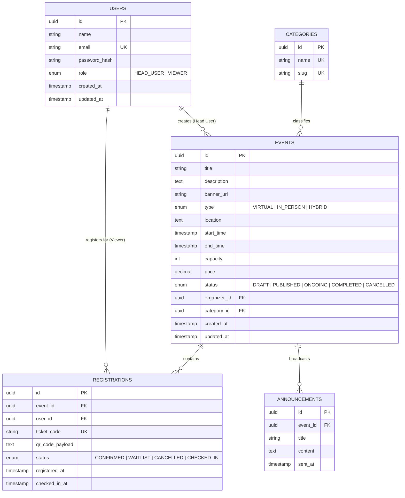

# 🗄️ Event Management System (EMS) — Database Specifications & Schema Design

## 1. Database Architecture & Design Strategy

The **Event Management System (EMS)** relies on a relational database (PostgreSQL / SQLite) designed for high concurrency, transactional integrity, and optimized query performance.

### 🌟 Key Design Highlights
* **Strict Foreign Key Constraints & Cascades:** Cascading deletions and updates maintain data consistency across users, events, and ticket registrations.
* **Concurrency Guards & Unique Constraints:** Multi-column unique indexes prevent double-registration for the same event by a single user.
* **Indexed Query Pathways:** Composite indexes optimize full-text searching, category filtering, attendee lookup, and QR code verification.
* **Role Enforcements:** Data level check constraints enforce valid roles (`HEAD_USER`, `VIEWER`), event statuses, and registration states.

---

## 2. Entity-Relationship (ER) Diagram



---

## 3. SQL Data Definition Language (DDL)

```sql
-- Enable UUID extension (PostgreSQL specific)
CREATE EXTENSION IF NOT EXISTS "uuid-ossp";

-- -----------------------------------------------------
-- 1. USERS TABLE
-- -----------------------------------------------------
CREATE TABLE users (
    id UUID PRIMARY KEY DEFAULT uuid_generate_v4(),
    name VARCHAR(100) NOT NULL,
    email VARCHAR(255) UNIQUE NOT NULL,
    password_hash VARCHAR(255) NOT NULL,
    role VARCHAR(20) NOT NULL CHECK (role IN ('HEAD_USER', 'VIEWER')),
    created_at TIMESTAMP WITH TIME ZONE DEFAULT CURRENT_TIMESTAMP,
    updated_at TIMESTAMP WITH TIME ZONE DEFAULT CURRENT_TIMESTAMP
);

-- -----------------------------------------------------
-- 2. CATEGORIES TABLE
-- -----------------------------------------------------
CREATE TABLE categories (
    id UUID PRIMARY KEY DEFAULT uuid_generate_v4(),
    name VARCHAR(50) UNIQUE NOT NULL,
    slug VARCHAR(50) UNIQUE NOT NULL
);

-- -----------------------------------------------------
-- 3. EVENTS TABLE
-- -----------------------------------------------------
CREATE TABLE events (
    id UUID PRIMARY KEY DEFAULT uuid_generate_v4(),
    title VARCHAR(150) NOT NULL,
    description TEXT NOT NULL,
    banner_url VARCHAR(500),
    type VARCHAR(20) NOT NULL CHECK (type IN ('VIRTUAL', 'IN_PERSON', 'HYBRID')),
    location TEXT,
    start_time TIMESTAMP WITH TIME ZONE NOT NULL,
    end_time TIMESTAMP WITH TIME ZONE NOT NULL,
    capacity INT NOT NULL CHECK (capacity >= 0),
    price DECIMAL(10, 2) NOT NULL DEFAULT 0.00 CHECK (price >= 0.00),
    status VARCHAR(20) NOT NULL DEFAULT 'DRAFT' CHECK (status IN ('DRAFT', 'PUBLISHED', 'ONGOING', 'COMPLETED', 'CANCELLED')),
    organizer_id UUID NOT NULL REFERENCES users(id) ON DELETE CASCADE,
    category_id UUID REFERENCES categories(id) ON DELETE SET NULL,
    created_at TIMESTAMP WITH TIME ZONE DEFAULT CURRENT_TIMESTAMP,
    updated_at TIMESTAMP WITH TIME ZONE DEFAULT CURRENT_TIMESTAMP,
    CONSTRAINT check_event_dates CHECK (end_time > start_time)
);

-- -----------------------------------------------------
-- 4. REGISTRATIONS (TICKETS) TABLE
-- -----------------------------------------------------
CREATE TABLE registrations (
    id UUID PRIMARY KEY DEFAULT uuid_generate_v4(),
    event_id UUID NOT NULL REFERENCES events(id) ON DELETE CASCADE,
    user_id UUID NOT NULL REFERENCES users(id) ON DELETE CASCADE,
    ticket_code VARCHAR(50) UNIQUE NOT NULL,
    qr_code_payload TEXT NOT NULL,
    status VARCHAR(20) NOT NULL DEFAULT 'CONFIRMED' CHECK (status IN ('CONFIRMED', 'WAITLIST', 'CANCELLED', 'CHECKED_IN')),
    registered_at TIMESTAMP WITH TIME ZONE DEFAULT CURRENT_TIMESTAMP,
    checked_in_at TIMESTAMP WITH TIME ZONE,
    CONSTRAINT unique_user_event UNIQUE (event_id, user_id)
);

-- -----------------------------------------------------
-- 5. ANNOUNCEMENTS TABLE
-- -----------------------------------------------------
CREATE TABLE announcements (
    id UUID PRIMARY KEY DEFAULT uuid_generate_v4(),
    event_id UUID NOT NULL REFERENCES events(id) ON DELETE CASCADE,
    title VARCHAR(150) NOT NULL,
    content TEXT NOT NULL,
    sent_at TIMESTAMP WITH TIME ZONE DEFAULT CURRENT_TIMESTAMP
);
```

---

## 4. Prisma ORM Schema (`schema.prisma`)

```prisma
datasource db {
  provider = "postgresql"
  url      = env("DATABASE_URL")
}

generator client {
  provider = "prisma-client-js"
}

enum Role {
  HEAD_USER
  VIEWER
}

enum EventType {
  VIRTUAL
  IN_PERSON
  HYBRID
}

enum EventStatus {
  DRAFT
  PUBLISHED
  ONGOING
  COMPLETED
  CANCELLED
}

enum RegistrationStatus {
  CONFIRMED
  WAITLIST
  CANCELLED
  CHECKED_IN
}

model User {
  id            String         @id @default(uuid()) @db.Uuid
  name          String         @db.VarChar(100)
  email         String         @unique @db.VarChar(255)
  passwordHash  String         @db.VarChar(255)
  role          Role           @default(VIEWER)
  createdAt     DateTime       @default(now())
  updatedAt     DateTime       @updatedAt

  createdEvents Event[]        @relation("OrganizerEvents")
  registrations Registration[]

  @@map("users")
}

model Category {
  id     String  @id @default(uuid()) @db.Uuid
  name   String  @unique @db.VarChar(50)
  slug   String  @unique @db.VarChar(50)
  events Event[]

  @@map("categories")
}

model Event {
  id          String      @id @default(uuid()) @db.Uuid
  title       String      @db.VarChar(150)
  description String      @db.Text
  bannerUrl   String?     @db.VarChar(500)
  type        EventType
  location    String?     @db.Text
  startTime   DateTime
  endTime     DateTime
  capacity    Int
  price       Decimal     @default(0.00) @db.Decimal(10, 2)
  status      EventStatus @default(DRAFT)

  organizerId String   @db.Uuid
  organizer   User     @relation("OrganizerEvents", fields: [organizerId], references: [id], onDelete: Cascade)

  categoryId  String?   @db.Uuid
  category    Category? @relation(fields: [categoryId], references: [id], onDelete: SetNull)

  registrations Registration[]
  announcements Announcement[]

  createdAt DateTime @default(now())
  updatedAt DateTime @updatedAt

  @@index([status, startTime])
  @@index([organizerId])
  @@map("events")
}

model Registration {
  id            String             @id @default(uuid()) @db.Uuid
  eventId       String             @db.Uuid
  event         Event              @relation(fields: [eventId], references: [id], onDelete: Cascade)
  userId        String             @db.Uuid
  user          User               @relation(fields: [userId], references: [id], onDelete: Cascade)
  ticketCode    String             @unique @db.VarChar(50)
  qrCodePayload String             @db.Text
  status        RegistrationStatus @default(CONFIRMED)
  registeredAt  DateTime           @default(now())
  checkedInAt   DateTime?

  @@unique([eventId, userId])
  @@index([ticketCode])
  @@index([eventId, status])
  @@map("registrations")
}

model Announcement {
  id      String   @id @default(uuid()) @db.Uuid
  eventId String   @db.Uuid
  event   Event    @relation(fields: [eventId], references: [id], onDelete: Cascade)
  title   String   @db.VarChar(150)
  content String   @db.Text
  sentAt  DateTime @default(now())

  @@map("announcements")
}
```

---

## 5. Indexing & Optimization Matrix

| Index Name | Table | Columns | Purpose / Query Optimization |
| :--- | :--- | :--- | :--- |
| `idx_users_email` | `users` | `email` | Fast authentication login lookups |
| `idx_events_status_start` | `events` | `status, start_time` | Optimized event catalog filtering (Public published events sorted by date) |
| `idx_events_organizer` | `events` | `organizer_id` | Fast fetching of Head User's owned events in dashboard |
| `idx_reg_ticket_code` | `registrations` | `ticket_code` | O(1) instant verification during QR code check-in scanner |
| `idx_reg_event_status` | `registrations` | `event_id, status` | Quick attendee list filtering & capacity calculations |

---

## 6. Seed Data Script Example (`seed.sql`)

```sql
-- Insert Sample Categories
INSERT INTO categories (id, name, slug) VALUES 
('c1111111-1111-1111-1111-111111111111', 'Technology', 'technology'),
('c2222222-2222-2222-2222-222222222222', 'Workshops', 'workshops'),
('c3333333-3333-3333-3333-333333333333', 'Music & Arts', 'music-arts');

-- Insert Head User (Organizer) & Normal Viewer
INSERT INTO users (id, name, email, password_hash, role) VALUES 
('u1111111-1111-1111-1111-111111111111', 'Alice Organizer', 'alice.organizer@ems.com', '$2b$10$e8Za3K...', 'HEAD_USER'),
('u2222222-2222-2222-2222-222222222222', 'Bob Attendee', 'bob.attendee@ems.com', '$2b$10$e8Za3K...', 'VIEWER');

-- Insert Sample Published Event
INSERT INTO events (id, title, description, banner_url, type, location, start_time, end_time, capacity, price, status, organizer_id, category_id) VALUES 
('e1111111-1111-1111-1111-111111111111', 'AI & Web Dev Summit 2026', 'Explore the future of agentic AI coding and fullstack web architecture.', 'https://images.unsplash.com/photo-1540575467063-178a50c2df87', 'HYBRID', 'Convention Center, San Francisco & Zoom Live Stream', '2026-10-15 09:00:00+00', '2026-10-15 17:00:00+00', 250, 0.00, 'PUBLISHED', 'u1111111-1111-1111-1111-111111111111', 'c1111111-1111-1111-1111-111111111111');

-- Insert Sample Ticket Registration
INSERT INTO registrations (id, event_id, user_id, ticket_code, qr_code_payload, status) VALUES 
('r1111111-1111-1111-1111-111111111111', 'e1111111-1111-1111-1111-111111111111', 'u2222222-2222-2222-2222-222222222222', 'TICK-1700000000-BOB99', '{"ticketCode":"TICK-1700000000-BOB99","eventId":"e1111111-1111-1111-1111-111111111111","userId":"u2222222-2222-2222-2222-222222222222","signature":"a7f3c..."}', 'CONFIRMED');
```
