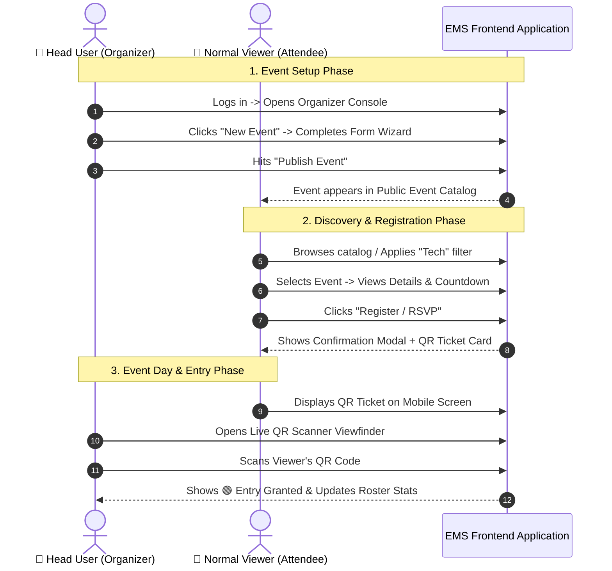

# 🎨 Event Management System (EMS) — Frontend Specifications & UI/UX Design

## 1. Frontend Architectural Overview & Design Philosophy

The frontend of the **Event Management System (EMS)** is engineered to deliver a modern, fluid, and visually captivating user interface. It caters to two primary user personas: **Head Users** (Organizers managing complex event lifecycles and attendee lists) and **Normal Viewers** (Attendees discovering, registering, and displaying tickets).

### 🎨 Design System Principles
* **Visual Excellence:** Deep dark mode with glassmorphic cards, vibrant accent gradients, ambient lighting effects, and clean micro-interactions.
* **Component-Driven Architecture:** Modular layout constructed using reusable UI components (Atoms, Molecules, Organisms).
* **Responsive & Mobile-First:** Seamless adaptivity from desktop dashboards to mobile screens (crucial for QR ticket presentation and mobile scanning).
* **Instant Feedback & Micro-Animations:** Loading skeletons, smooth modal transitions, status pill animations, and instant toast notifications.

---

## 2. Route Hierarchy & Navigation Tree

```mermaid
graph TD
    App[EMS Web App Root] --> PublicLayout[Public Layout]
    App --> DashboardLayout[Organizer Dashboard Layout]
    App --> AuthLayout[Auth Layout]

    subgraph Auth Views
        AuthLayout --> Login[/login]
        AuthLayout --> Register[/register]
    end

    subgraph Viewer / Public Views
        PublicLayout --> Home[/ - Landing & Catalog Discovery]
        PublicLayout --> EventDetails[/events/:id - Event Details & RSVP]
        PublicLayout --> MyTickets[/my-tickets - Attendee Ticket Wallet]
        PublicLayout --> Profile[/profile - Viewer Settings]
    end

    subgraph Head User / Organizer Views
        DashboardLayout --> OrgOverview[/organizer - Events & Stats Overview]
        DashboardLayout --> EventCreate[/organizer/events/new - Event Builder Wizard]
        DashboardLayout --> EventEdit[/organizer/events/:id/edit - Event Editor]
        DashboardLayout --> Attendees[/organizer/events/:id/attendees - Attendee Roster]
        DashboardLayout --> QRScanner[/organizer/checkin - Live Ticket QR Scanner]
        DashboardLayout --> Analytics[/organizer/analytics - Revenue & Conversion Reports]
    end
```

---

## 3. UI/UX Page Specifications & Components

### 3.1. Landing & Discovery Page (`/`) — Normal Viewer
* **Hero Banner:** Ambient gradient background, live platform statistics (e.g. Total Events, Happy Attendees), and quick call-to-action ("Explore Events").
* **Search & Filter Bar:**
  * Search input with debounce and instant keyword highlighting.
  * Category chips (All, Tech, Workshop, Concert, Esports, Business).
  * Filter dropdowns: Location type (All, In-Person, Virtual), Date (Today, This Week, Weekend), and Price (Free, Paid).
* **Event Grid Card:**
  * Image thumbnail with subtle hover zoom effect.
  * Status badge (`PUBLISHED`, `SOLD OUT`, `LIVE`).
  * Event title, host avatar, date/time badge, and location snippet.
  * Dynamic progress bar showing seats remaining (e.g. *"Only 12 seats left!"*).

---

### 3.2. Event Details & RSVP Page (`/events/:id`) — Normal Viewer
* **Header Backdrop:** High-resolution banner image with dark overlay gradient.
* **Event Meta Panel:**
  * Date/Time, Venue Address with embedded interactive map preview or Zoom link placeholder.
  * Organizer details badge.
  * Live countdown timer (`Days : Hours : Mins : Secs`) until event start.
* **Tabbed Content Sections:**
  1. **Overview & Agenda:** Rich text description, event schedule timeline.
  2. **Speakers / Hosts:** Cards displaying avatar, name, title, bio, and social links.
  3. **FAQ & Location:** Expandable accordion components for common questions.
* **Sticky RSVP Card / Action Sidebar:**
  * Pricing display ("FREE" or formatted currency amount).
  * Seat availability indicator.
  * Primary Action Button: "Register Now" / "Join Waitlist" / "Sold Out".
  * Direct social share buttons (Twitter, LinkedIn, WhatsApp, Copy Link).

---

### 3.3. Ticket Wallet Page (`/my-tickets`) — Normal Viewer
* **Card Carousel / Grid:** Switchable tabs between "Upcoming Events" and "Past Events".
* **Digital Ticket Component:**
  * Styled like a modern boarding pass / event pass with perforated aesthetic.
  * Cryptographic QR Code display for mobile check-in.
  * "Add to Calendar" dropdown (`.ics`, Google Calendar, Outlook).
  * "Download Ticket PDF" & "Cancel RSVP" action buttons.

---

### 3.4. Organizer Console (`/organizer`) — Head User
* **Summary Metric Cards:**
  * Total Active Events, Total Registrations, Attendance Conversion Rate, Revenue.
* **Event Management Table:**
  * Columns: Event Name, Date, Type (Virtual/In-Person), Status Pill (`DRAFT`, `PUBLISHED`, `ONGOING`, `COMPLETED`, `CANCELLED`), Registered Count / Capacity, Quick Actions.
  * Quick Actions: Edit Event, View Attendee Roster, Change Status, Delete.

---

### 3.5. Event Builder Wizard (`/organizer/events/new`) — Head User
* **Multi-Step Form Pipeline:**
  * **Step 1: General Info:** Title, category, summary, detailed description, cover image upload.
  * **Step 2: Time & Location:** Start/End timestamps, timezone select, location mode (Virtual URL / In-Person Map Address).
  * **Step 3: Capacity & Pricing:** Max seating limit, free/paid toggle, price input, registration deadline.
  * **Step 4: Review & Publish:** Summary preview card with "Save as Draft" or "Publish Immediately" actions.

---

### 3.6. Attendee Roster & Management (`/organizer/events/:id/attendees`) — Head User
* **Roster Controls:** Search attendee by name/email, status filter (`CONFIRMED`, `CHECKED_IN`, `CANCELLED`).
* **CSV Export Button:** Single-click export of filtered attendee list.
* **Manual Check-In Toggle:** Switch toggle to mark attendee as present manually.

---

### 3.7. Live QR Scanner (`/organizer/checkin`) — Head User
* **Camera Scanner Viewfinder:** Video stream integration using web camera for real-time QR decoding.
* **Instant Visual & Audio Feedback:**
  * 🟢 **Green Overlay + Chime:** Valid Ticket $\rightarrow$ Displays Attendee Name & Seat Details.
  * 🟡 **Yellow Overlay + Alert:** Warning $\rightarrow$ Ticket Already Checked-in at `<Time>`.
  * 🔴 **Red Overlay + Error Sound:** Invalid $\rightarrow$ Ticket not found or wrong event.

---

## 4. Component Tree & UI Architecture

```
src/
├── assets/                  # Icons, illustrations, static assets
├── components/
│   ├── ui/                  # Design System Primitive Atoms
│   │   ├── Button.jsx
│   │   ├── Input.jsx
│   │   ├── Modal.jsx
│   │   ├── Badge.jsx
│   │   ├── Card.jsx
│   │   ├── Tabs.jsx
│   │   └── Toast.jsx
│   ├── layout/              # Navbars, Sidebars, Footers
│   │   ├── Navbar.jsx
│   │   ├── Footer.jsx
│   │   └── OrganizerSidebar.jsx
│   ├── events/              # Event Domain Components
│   │   ├── EventCard.jsx
│   │   ├── EventFilterBar.jsx
│   │   ├── CountdownTimer.jsx
│   │   └── AgendaTimeline.jsx
│   ├── tickets/             # Ticket Domain Components
│   │   ├── DigitalTicketCard.jsx
│   │   └── QRCodeModal.jsx
│   └── organizer/           # Head User Components
│       ├── StatMetricCard.jsx
│       ├── EventFormWizard.jsx
│       ├── AttendeeTable.jsx
│       └── QRCameraScanner.jsx
├── context/                 # Auth & App Theme Context Providers
├── hooks/                   # Custom Hooks (useAuth, useEvents, useScanner)
├── pages/                   # Top-level Page Views
└── utils/                   # Formatting, date parsing, QR generator helpers
```

---

## 5. UI Design System & CSS Utility Tokens

### 🎨 Color Palette (Tailored HSL & Dark Mode Tokens)
```css
:root {
  /* Brand Primary & Accents */
  --color-primary: hsl(250, 84%, 60%);        /* Deep Indigo */
  --color-primary-hover: hsl(250, 84%, 68%);
  --color-accent: hsl(320, 85%, 55%);         /* Electric Violet / Magenta */
  
  /* Status Colors */
  --color-success: hsl(145, 65%, 42%);        /* Emerald Green */
  --color-warning: hsl(38, 92%, 50%);         /* Warm Amber */
  --color-danger: hsl(355, 78%, 56%);         /* Coral Red */

  /* Dark Theme Surfaces */
  --bg-app: hsl(222, 47%, 7%);                /* Midnight Base */
  --bg-surface: hsl(222, 40%, 12%);           /* Card Background */
  --bg-surface-elevated: hsl(222, 35%, 17%);  /* Hover / Modal Surface */
  --border-subtle: rgba(255, 255, 255, 0.08);
  --border-glow: rgba(138, 43, 226, 0.3);

  /* Typography Colors */
  --text-main: hsl(210, 40%, 98%);
  --text-muted: hsl(215, 20%, 65%);
  --text-heading: #ffffff;
}
```

### 💫 Glassmorphism & Micro-Interactions
```css
/* Glassmorphic Panel Utility */
.glass-panel {
  background: rgba(22, 28, 45, 0.7);
  backdrop-filter: blur(12px);
  -webkit-backdrop-filter: blur(12px);
  border: 1px solid var(--border-subtle);
  box-shadow: 0 8px 32px 0 rgba(0, 0, 0, 0.37);
}

/* Micro-Animation on Interactive Cards */
.event-card {
  transition: transform 0.25s ease, box-shadow 0.25s ease;
}

.event-card:hover {
  transform: translateY(-4px);
  box-shadow: 0 12px 24px -10px var(--border-glow);
}
```

---

## 6. User Journey Flow (Role Comparison)


