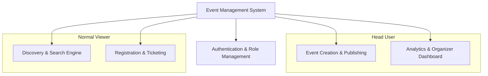
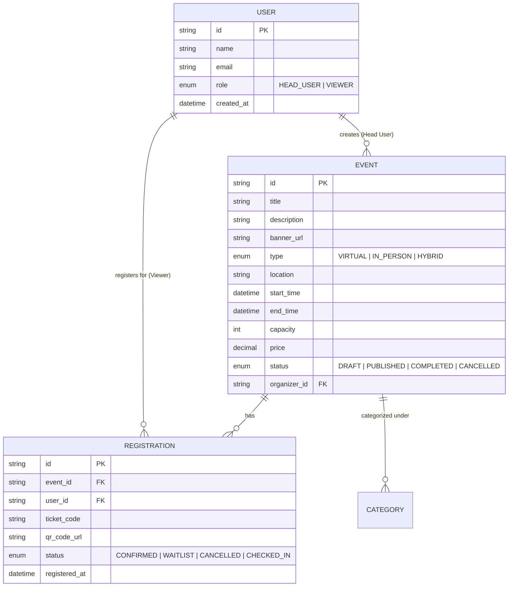

# 🎪 Event Management System (EMS) — Project Idea & Specification

## 1. Executive Summary
The **Event Management System (EMS)** is a centralized web platform designed to streamline planning, publishing, discovering, and managing events. It caters to two distinct types of users: **Head Users (Organizers/Admins)** who curate and manage events, and **Normal Viewers (Attendees/Participants)** who explore and register for events.

---

## 2. Target User Personas & Roles

### 👑 1. Head User (Organizer / Admin)
* **Goal:** Create, organize, manage, and monitor events effectively while tracking attendance and engagement.
* **Key Permissions & Capabilities:**
  * **Event Lifecycle Management:** Create, edit, publish, unpublish, postpone, or cancel events.
  * **Capacity & Ticket Settings:** Set event capacity limits, registration deadlines, ticket tiers (Free/Paid/VIP), and pricing.
  * **Attendee Management:** View list of registered viewers, approve/reject registrations (if approval required), export attendee lists (CSV/PDF), and mark check-ins.
  * **Analytics & Reports:** Monitor real-time stats such as registration counts, ticket sales, revenue, and attendance rates.
  * **Broadcast Announcements:** Send event updates, reminders, or schedule changes to registered viewers.

---

### 👤 2. Normal Viewer (Attendee / Participant)
* **Goal:** Discover interesting events, view event details, register/RSVP smoothly, and receive relevant updates.
* **Key Permissions & Capabilities:**
  * **Event Discovery:** Browse, search, filter, and sort events by date, category, location (virtual/in-person), and availability.
  * **Event Details:** Access rich event information including schedule, agenda, speaker profiles, venue maps, and FAQ.
  * **Registration / RSVP:** Register for free or paid events, receive confirmation emails/QR tickets, and add events to personal calendars (Google/Outlook/iCal).
  * **Personal Dashboard:** View upcoming and past registered events, download tickets, and cancel registrations if needed.
  * **Feedback & Engagement:** Rate and review attended events and submit questions to organizers.

---

## 3. Core Functional Modules

### 3.1. Authentication & Role-Based Access Control (RBAC)
* Secure sign-up/login (Email/Password, OAuth via Google/GitHub).
* Role assignment during onboarding or role upgrade requests.
* Protected routes and API endpoints enforcing permission checks.

### 3.2. Event Management Engine (Head User)
* **Rich Event Creation Form:**
  * Basic details: Title, description, tags, category (e.g., Tech, Music, Workshop, Conference).
  * Date & Time: Start/end date and time with timezone support.
  * Venue: Physical address with map integration or virtual meeting link (Zoom, Meet, etc.).
  * Media: Banner image, thumbnail, promo video embed, promotional attachments.
  * Capacity & Pricing: Max seats, waitlist option, ticket types.
* **Status Controls:** Draft, Scheduled, Published, Ongoing, Completed, Cancelled.

### 3.3. Discovery & Catalog (Normal Viewer)
* Modern responsive catalog with card and grid layouts.
* Search bar with fuzzy matching and autocomplete.
* Filter facets: Category, Date range, Free vs. Paid, In-person vs. Virtual, Popularity.
* Interactive Event Detail page with countdown timer and social sharing links.

### 3.4. Registration & Ticket Delivery
* Instant 1-click registration for authenticated viewers.
* Generation of a unique digital ticket with **QR Code** for entry verification.
* Automated email confirmation with calendar `.ics` invite attachment.

### 3.5. Analytics & Head User Dashboard
* Real-time metrics: Total registrations, occupancy rate, views/clicks.
* Attendee list with search, status filters (Confirmed, Waitlisted, Checked-in), and CSV export.
* Quick QR scanner for on-day check-in.

---

## 4. Role & Permissions Matrix

| Feature / Action | Head User (Organizer) | Normal Viewer (Attendee) |
| :--- | :---: | :---: |
| Browse public events | ✅ | ✅ |
| Search & filter events | ✅ | ✅ |
| View event details & agenda | ✅ | ✅ |
| Register / RSVP for events | ✅ | ✅ |
| Access personal ticket / QR code | ✅ | ✅ |
| Cancel own registration | ❌ | ✅ |
| Create new events | ✅ | ❌ |
| Edit / Update event details | ✅ (Own events) | ❌ |
| Delete / Cancel events | ✅ (Own events) | ❌ |
| View attendee list & details | ✅ | ❌ |
| Export attendee data (CSV/Excel) | ✅ | ❌ |
| Verify tickets (Check-in scanner) | ✅ | ❌ |
| View analytics & registration metrics | ✅ | ❌ |

---

## 5. Core Data Models

---

## 6. Suggested Tech Stack

| Layer | Recommended Technologies |
| :--- | :--- |
| **Frontend** | React / Next.js or Vanilla HTML/CSS/JS with modern UI design system |
| **Styling** | Vanilla CSS (CSS Variables, Flexbox/Grid, Glassmorphism, Dark Mode) |
| **Backend** | Node.js (Express / NestJS) or Python (FastAPI) |
| **Database** | PostgreSQL / SQLite (with Prisma or Drizzle ORM) or MongoDB |
| **Authentication** | JWT-based auth or NextAuth / Supabase Auth / Firebase Auth |
| **Utilities** | QR code generator (`qrcode`), date handling (`date-fns`), CSV parser |

---

## 7. Future Scope & Enhancements
* **Payment Gateway Integration:** Stripe / Razorpay for paid ticketing.
* **Live Chat & Q&A:** Real-time engagement module during live/virtual events.
* **Automated Reminders:** SMS/WhatsApp and email reminders 24h and 1h before event start.
* **Certificate of Participation:** Automatic PDF certificate generation post-event.
